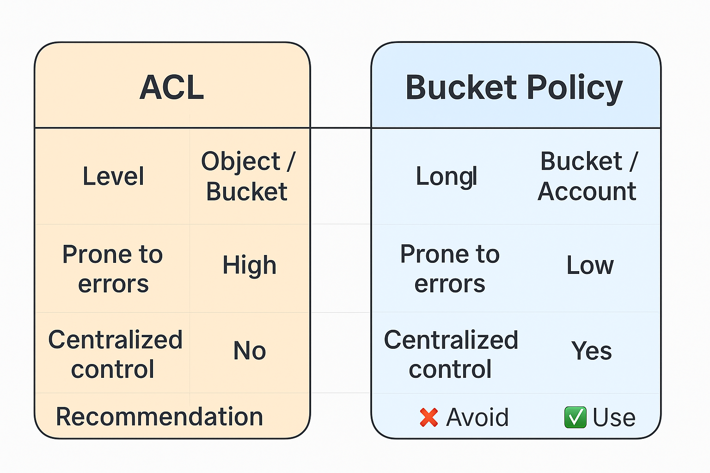

> S3 Enforce Object Ownership là một tính năng bảo mật trong Amazon S3 dùng để kiểm soát quyền sở hữu đối với các đối 
> tượng (objects) được upload vào bucket — đặc biệt khi có nhiều tài khoản AWS khác nhau cùng tương tác với bucket đó.


### 🧩 Mục đích chính

Khi bạn bật Enforce Object Ownership, S3 sẽ bỏ qua các ACL (Access Control List) và tự động đặt quyền sở hữu của mọi object cho chủ sở hữu bucket.
Điều này giúp đảm bảo rằng người sở hữu bucket luôn là người sở hữu dữ liệu, bất kể ai upload file.

> 👉 Từ năm 2023, AWS khuyến nghị mạnh mẽ sử dụng “Bucket owner enforced” để tránh rủi ro bảo mật và lỗi truy cập khi 
> làm việc đa tài khoản (cross-account).

### 🔐 Lợi ích của “Enforce Object Ownership”
	1.	Đơn giản hóa quyền truy cập: Không cần ACL phức tạp – mọi quyền được kiểm soát bằng bucket policy hoặc IAM.
	2.	Ngăn xung đột quyền sở hữu: Tránh lỗi “Access Denied” khi người khác upload object nhưng bạn không có quyền đọc/xóa.
	3.	Tuân thủ bảo mật & chuẩn AWS Well-Architected: Giúp đáp ứng nguyên tắc “Least Privilege” và “Data Governance”.


### 💡 Ví dụ thực tế

Giả sử:

	•	Bạn có bucket company-data thuộc tài khoản A.
	•	Một người từ tài khoản B upload file report.csv vào bucket đó.

Nếu không bật enforce ownership, file report.csv sẽ thuộc quyền sở hữu của tài khoản B, khiến A không thể xóa hoặc sửa file đó.

➡ Khi bật Bucket owner enforced, file upload từ B vẫn sẽ thuộc quyền của A — tránh lỗi truy cập hoặc rò rỉ dữ liệu.


### ✅ Cách bật Enforce Object Ownership (CLI)

```shell
aws s3api put-bucket-ownership-controls \
  --bucket my-bucket \
  --ownership-controls Rules=[{ObjectOwnership=BucketOwnerEnforced}]
```

## ACL
> ACL (Access Control List) trong Amazon S3 là một cơ chế kiểm soát quyền truy cập cấp độ đối tượng hoặc bucket. Nó 
> định nghĩa ai có thể truy cập (AWS account hoặc public) và được phép làm gì (đọc, ghi, hoặc quản lý quyền) trên các đối tượng trong S3.

#### 🧩 1. Khái niệm cơ bản

ACL là một danh sách quyền (list of permissions) được gắn vào bucket hoặc object trong S3.
Mỗi quyền trong ACL được xác định cho một “grantee” — có thể là:
	•	Một tài khoản AWS cụ thể
	•	Một user nhóm đặc biệt (ví dụ: AllUsers – công khai Internet)
	•	Hoặc chủ sở hữu bucket (bucket owner)

#### ⚙️ 2. Các loại quyền phổ biến

| Quyền | Mô tả                                             |
|--------|---------------------------------------------------|
| **READ** | Cho phép xem nội dung object hoặc liệt kê bucket  |
| **WRITE** | Cho phép upload, ghi đè hoặc xóa object           |
| **READ_ACP** | Cho phép đọc danh sách quyền (ACL) hiện tại       |
| **WRITE_ACP** | Cho phép thay đổi ACL                             |
| **FULL_CONTROL** | Toàn quyền (bao gồm tất cả quyền trên)            |


#### 💡 3. Ví dụ: ACL ở cấp Object

Giả sử bạn upload file lên bucket và muốn công khai file đó:
```shell
aws s3api put-object-acl \
  --bucket my-bucket \
  --key photo.jpg \
  --acl public-read
```

👉 Khi đó, mọi người có thể truy cập https://my-bucket.s3.amazonaws.com/photo.jpg mà không cần đăng nhập AWS.

#### 🔐 4. Vấn đề với ACL

ACL là công cụ cũ và dễ gây lỗi bảo mật:

	•	Dễ vô tình mở quyền public (như AllUsers).
	•	Khó quản lý khi có nhiều tài khoản AWS cùng thao tác.
	•	Gây xung đột quyền sở hữu (object có thể thuộc user khác).

➡ Vì vậy, AWS khuyến nghị tắt ACL bằng cách bật:

> ObjectOwnership = BucketOwnerEnforced

Khi đó, quyền truy cập nên được quản lý qua IAM policy hoặc bucket policy — an toàn và rõ ràng hơn.

#### 🧠 Tóm tắt

| Tính năng | ACL | Bucket Policy / IAM Policy |
|------------|-----|-----------------------------|
| **Cấp độ** | Object / Bucket | Bucket / Account |
| **Dễ sai sót** | Cao | Thấp |
| **Kiểm soát tập trung** | Không | Có |
| **Khuyến nghị hiện nay** | ❌ Tránh dùng | ✅ Nên dùng |

